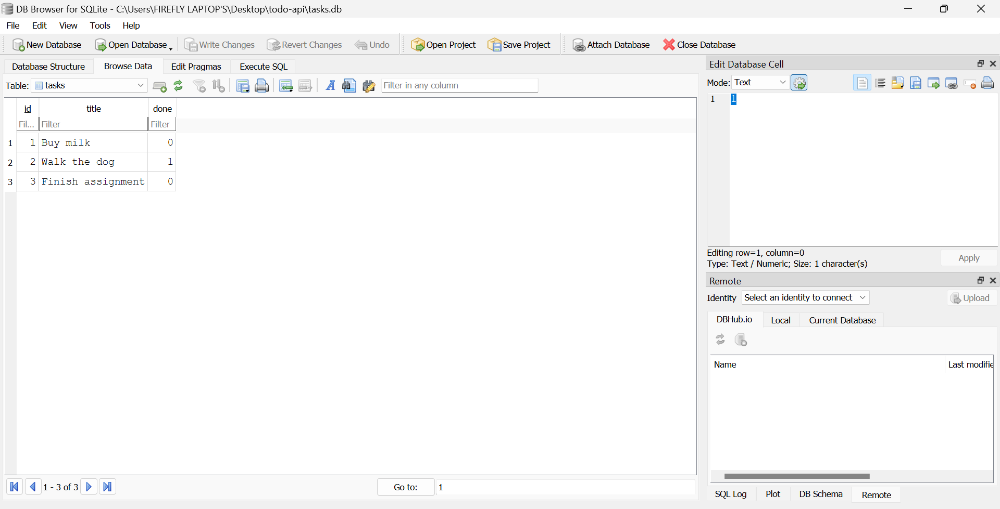

# Task API

A simple CRUD (Create, Read, Update, Delete) API for managing a to-do list, built with FastAPI as part of the FlyRank Internship Backend Track. Data is stored in a SQLite database (`tasks.db`), so it survives a server restart.

## Why SQLite

SQLite was chosen because it's a single file with no separate server to install or run — perfect for a small project like this. It gives real persistence (data survives restarts) without any setup overhead, and it's built directly into Python's standard library.

## Where the database lives

`tasks.db` is created automatically the first time the app runs. It's git-ignored, so a fresh clone won't include it — instead, the app creates the file, creates the `tasks` table, and seeds 3 example tasks the first time it starts up. Restarting the server does not duplicate the seed data.

## How to run it

1. Clone this repo and move into it:

git clone https://github.com/Nur-097/todo-api.git
cd todo-api

2. Create and activate a virtual environment:

python -m venv venv
venv\Scripts\Activate.ps1

3. Install dependencies:

pip install fastapi uvicorn

4. Run the server:

uvicorn main:app --reload

5. Visit `http://localhost:8000` in your browser. On first run, `tasks.db` is created automatically with 3 example tasks.

## Endpoints

| Method | Path | Description |
|--------|------|-------------|
| GET | `/` | Basic info about the API |
| GET | `/health` | Health check |
| GET | `/tasks` | List all tasks |
| GET | `/tasks/{id}` | Get a single task by id |
| POST | `/tasks` | Create a new task (requires a non-empty `title`) |
| PUT | `/tasks/{id}` | Update a task's title and/or done status |
| DELETE | `/tasks/{id}` | Delete a task |

All endpoints behave exactly as they did with the in-memory version from Assignment 1 — only the storage layer underneath changed, from a Python list to SQLite.

## Example request

curl -i http://localhost:8000/tasks/1

HTTP/1.1 200 OK
content-type: application/json

{"id":1,"title":"Buy milk","done":0}

## Swagger UI

Interactive API docs are available at `http://localhost:8000/docs` once the server is running — you can try every endpoint directly from the browser.

## Stage 4 — Exploring SQLite

Opened `tasks.db` directly in DB Browser for SQLite and ran queries by hand, confirming the API and DB Browser read the exact same file with no syncing required.

Ran `SELECT * FROM tasks WHERE done = 1;` in DB Browser — returned the single completed task ("Walk the dog"), confirming filtering works directly against the SQLite file.

Also confirmed that running `UPDATE tasks SET done = 1;` in DB Browser was reflected instantly through `GET /tasks` with no server restart, and that deleting all rows and restarting the server correctly re-triggered the seed logic — proving the seed-only-when-empty check works as intended.

## Stage 6 — AI vs me

**My prompt:**

> I have a FastAPI to-do app that currently stores tasks in an in-memory Python list. I want you to migrate it to use a SQLite database instead, using Python's built-in `sqlite3` module (not an ORM).
>
> Requirements:
> - Create a `tasks.db` file with a `tasks` table if it doesn't already exist. The table should have three columns: `id` (integer, primary key), `title` (text), `done` (boolean, stored as 0/1).
> - Seed the table with 3 example tasks, but only if the table is currently empty — don't duplicate the seed data on every restart.
> - Keep these 5 endpoints with identical behavior to the original in-memory version: `GET /tasks`, `GET /tasks/{id}`, `POST /tasks`, `PUT /tasks/{id}`, `DELETE /tasks/{id}`.
> - `POST` should return 400 if the title is missing or empty.
> - `GET /tasks/{id}`, `PUT /tasks/{id}`, and `DELETE /tasks/{id}` should return 404 if the id doesn't exist.
> - All queries must use parameterized placeholders (`?`) — never insert user input directly into a SQL string.
> - Don't change the API's routes, request/response shapes, or status codes — only the storage layer underneath should change.

**What it did better:**
The AI's `row_to_task()` function explicitly converts SQLite's `0`/`1` into a real JSON boolean (`"done": false`), while my version returns the raw integer straight from the database. The AI's response is technically closer to a "proper" API. It also used `AUTOINCREMENT` on the primary key, which guarantees ids are never reused after a delete — my version doesn't guarantee that.

**What it got wrong:**
- `DELETE /tasks/{id}` returns `200` with a `{"message": "Task deleted"}` body instead of the spec's required `204` with an empty body.
- `PUT /tasks/{id}` requires `title` in every request. Sending only `{"done": true}` (a legitimate partial update, matching "update a task's title and/or done status") gets rejected with a `422` error — my version correctly allows updating just one field.

**What my prompt forgot to specify:**
I never told it what status code `DELETE` should return, or that `PUT` needed to support partial updates (only `title`, only `done`, or both) — the AI defaulted to the more common REST convention (`200` + body) and a simpler schema that assumed every field would always be sent. Both are reasonable defaults for a prompt that didn't rule them out, but they don't match this assignment's exact spec.

**One rematch:**
Adding "return 204 with an empty body on delete" and "title and done should both be optional in the update, so a client can send either field independently" to the prompt would likely fix both issues in a second pass.