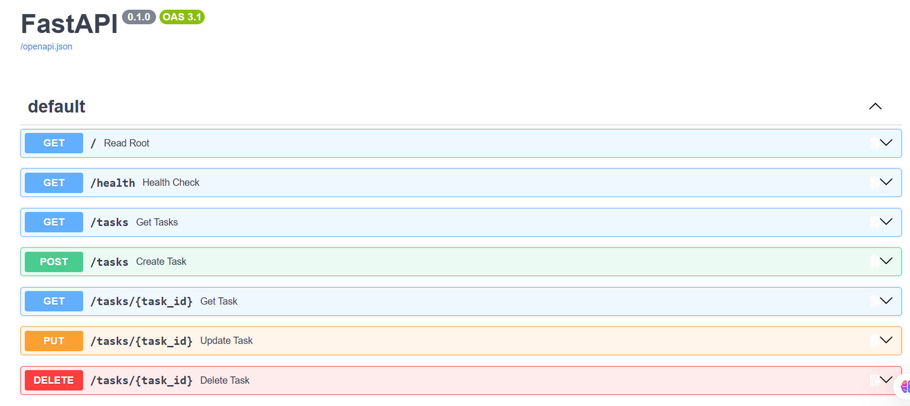

# Task API

A simple CRUD (Create, Read, Update, Delete) API for managing a to-do list, built with FastAPI as part of the FlyRank Internship Backend Track (Week 2, Assignment A1).

Data is stored in memory only — it resets whenever the server restarts. There's no database yet; that's next week's lesson.

## How to run it

1. Clone this repo and move into it:
   ```
   git clone https://github.com/Nur-097/todo-api.git
   cd todo-api
   ```

2. Create and activate a virtual environment:
   ```
   python -m venv venv
   venv\Scripts\Activate.ps1
   ```

3. Install dependencies:
   ```
   pip install fastapi uvicorn
   ```

4. Run the server:
   ```
   uvicorn main:app --reload
   ```

5. Visit `http://localhost:8000` in your browser.

## Endpoints

| Method | Path | Description |
|--------|------|-------------|
| GET | `/` | Basic info about the API |
| GET | `/health` | Health check |
| GET | `/tasks` | List all tasks |
| GET | `/tasks/{id}` | Get a single task by id |
| POST | `/tasks` | Create a new task (requires a non-empty `title`) |
| PUT | `/tasks/{id}` | Update a task's title and/or done status |
| DELETE | `/tasks/{id}` | Delete a task |

## Example request

```
curl -i http://localhost:8000/tasks/1
```

```
HTTP/1.1 200 OK
content-type: application/json

{"id":1,"title":"Buy milk","done":false}
```

## Swagger UI

Interactive API docs are available at `http://localhost:8000/docs` once the server is running — you can try every endpoint directly from the browser.



## The mortality experiment

Restarting the server resets all tasks back to the original 3 examples — any tasks created, updated, or deleted during a session are lost. This is expected: the data lives only in memory, in a Python list, with nothing written to disk. It's the reason Week 3 introduces a real database.